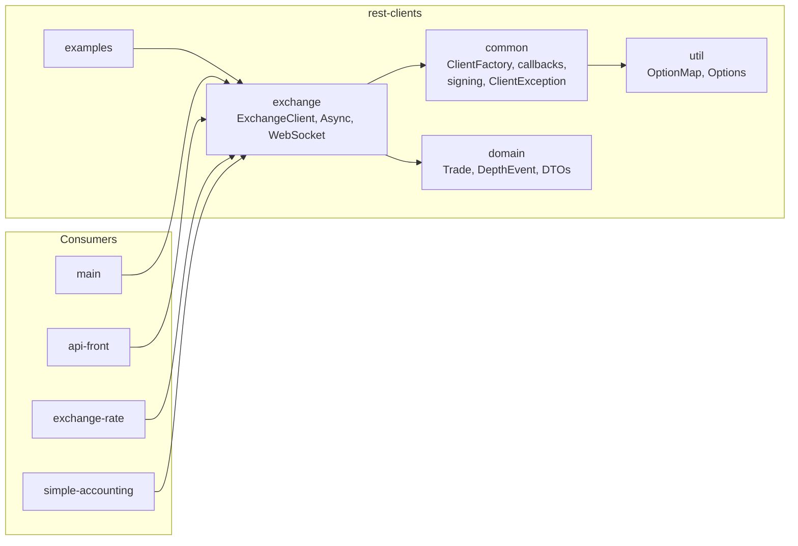

# NiceHash Exchange REST Clients

Client library for the NiceHash **Exchange API** — synchronous, asynchronous, and WebSocket clients with request signing (API key/secret). Built as a small multi-module Maven project (`com.nicehash:rest-clients:1-SNAPSHOT`) and consumed by backend services that need exchange access.

Not to be confused with `platform-utils/platform-clients`, which holds the typed **inter-service** HTTP clients — this library targets the public Exchange API surface.

---

## Module Map



| Module | Provides |
|--------|----------|
| `util` | `OptionMap` / `Options` configuration primitives |
| `common` | Client plumbing: `ClientFactory`, `ClientGenerator`, `ClientCallback` / `AbstractClientCallback`, `ClientException`, converters |
| `domain` | Exchange DTOs (`Trade`, `DepthEvent`, order book types, …) |
| `exchange` | `ExchangeClient` (sync), `ExchangeAsyncClient`, `ExchangeWebSocketClient`, `ExchangeClientFactory` |
| `examples` | Runnable usage examples |

---

## Usage

### Synchronous client

```java
OptionMap options = OptionMap.builder()
                             .set(Options.BASE_URL, "https://api-test.nicehash.com/exchange/")
                             .set(Options.KEY, "<KEY>")
                             .set(Options.SECRET, "<SECRET>")
                             .getMap();

ExchangeClientFactory factory = ExchangeClientFactory.newInstance(options);
ExchangeClient client = factory.newClient();
List<Trade> trades = client.getMyTrades("LTCBTC");
```

### Asynchronous client

```java
client.getMyTrades("LTCBTC", 100, new AbstractClientCallback<List<Trade>>() {
    @Override
    public void onResponse(List<Trade> trades) {
        System.out.println("Trades = " + trades);
    }
});
```

### WebSocket client

```java
try (ExchangeWebSocketClient client = ExchangeClientFactory.newWebSocketClient("https://exchange-test.nicehash.com/ws")) {
    client.onDepthEvent("LTCBTC", new AbstractClientCallback<DepthEvent>() {
        @Override
        public void onResponse(DepthEvent result) {
            System.out.println("Result = " + result);
        }
    });
}
```

Authentication is handled by the factory from `Options.KEY` / `Options.SECRET`; per-request signing lives in `common`.

---

## Build

```bash
mvn clean install -DskipTests
```

## Branches

| Branch | Stack |
|--------|-------|
| `master` | Java 21 · `jakarta.*` (the `nicehash-v3` migration has been merged in) |
| `nicehash-v3` | Migration branch, merged into `master` and kept in sync |
